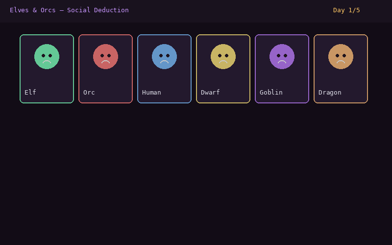

# Elves & Orcs

[](https://github.com/stennu718/elves-orcs/actions/workflows/tests.yml)
[](https://opensource.org/licenses/MIT)
[](https://github.com/stennu718/elves-orcs/releases)
[](https://github.com/stennu718/elves-orcs/pkgs/container/elves-orcs)

**Live Demo:** [https://stennu718.github.io/elves-orcs/](https://stennu718.github.io/elves-orcs/)


## Description

**Elves & Orcs** is a digital adaptation of the Estonian social deduction game **"Kings & Spies"** (*Kuningad & Spioonid*). In this tense deduction challenge, you must identify two hidden spies among your team of 8 characters before time runs out.

Originally a tabletop game popular in Estonia, Kings & Spies tests your ability to analyze behavior, track patterns, and make logical deductions under pressure. This digital adaptation brings the experience to life with an interactive interface, animated UI, and streamlined gameplay — playable directly in your browser.

## Demo



## Try it

🕵️ **[Try Live Demo](https://stennu718.github.io/elves-orcs/demo/)** — watch AI play, solve the deduction puzzle

Or run locally:
```bash
npm install && npm run dev
```

## Features

- **Social deduction gameplay** — Analyze mission results to uncover hidden spies
- **5-day time limit** — Race against the clock to gather enough information
- **Mission system** — Send 3 characters per mission and observe the results
- **Note-taking tools** — Mark characters as innocent or spy to track your deductions
- **Animated UI** — Smooth transitions and effects with Framer Motion
- **Responsive design** — Playable on desktop and mobile browsers
- **Dark medieval theme** — Atmospheric UI with Tailwind CSS styling
- **Tested core logic** — 28+ unit tests covering all game mechanics

## How to Play

1. You have **5 in-game days** to identify **2 hidden spies** among 8 characters.
2. Each day, select **3 characters** to send on a mission (council).
3. After dispatching, the mission log reveals **how many spies** were on that mission.
4. Use the **note buttons** (✓ for innocent, 💀 for spy) to track your deductions.
5. Cross-reference mission results to narrow down suspects.
6. On **Day 5**, make your final accusation — choose the 2 characters you believe are spies.

**Correct guess = Victory. Wrong guess = The kingdom falls.**

### Strategy Tip
If a mission with 3 characters returned 0 spies, all three are safe. Use logic and process of elimination to narrow down the suspects!

## Controls

| Action | How |
|--------|-----|
| Select character for mission | Click on a character card |
| Deselect character | Click again on selected card |
| Mark character as innocent | Click the ✓ button on a character card |
| Mark character as spy | Click the 💀 button on a character card |
| Dispatch mission | Click "Dispatch Council" (requires 3 selected) |
| Make final accusation | Click "Make Final Accusation" or wait until Day 5 |
| Start new game | Click "Play Again" after game ends |

## Quick Start

### Prerequisites

- Node.js 18+ and npm

### Installation

```bash
# Clone the repository
git clone https://github.com/stennu718/elves-orcs.git
cd elves-orcs

# Install dependencies
npm install

# Start development server
npm run dev
```

The game will be available at `http://localhost:3000`.

### Build for Production

```bash
npm run build
npm run preview
```

### Run Tests

```bash
npm test
```

### Docker

```bash
docker build -t elves-orcs .
docker run -p 3000:3000 elves-orcs
```

## Architecture

### Tech Stack

- **Language:** TypeScript 5+
- **Framework:** React 19
- **Build Tool:** Vite 6
- **Styling:** Tailwind CSS 4
- **Animations:** Framer Motion
- **Icons:** Lucide React
- **Testing:** Vitest + Testing Library
- **CI/CD:** GitHub Actions
- **Deployment:** GitHub Pages + Docker

### Application Architecture

The application follows a **component-based architecture** with clear separation between game logic and presentation:

```
┌─────────────────────────────────────────┐
│              React App (App.tsx)         │
│  ┌───────────┬───────────┬────────────┐  │
│  │  Roster   │  Action   │   Mission  │  │
│  │  Panel    │  Area     │   Log      │  │
│  │ (select)  │ (dispatch)│ (history)  │  │
│  └───────────┴───────────┴────────────┘  │
├─────────────────────────────────────────┤
│         Game Logic (logic.ts)            │
│  - selectSpies()    - countSpies()       │
│  - checkAccusation() - toggleNote()      │
│  - combinations()                        │
└─────────────────────────────────────────┘
```

### Key Design Decisions

1. **Pure Logic Separation** — All game rules live in `src/game/logic.ts` as pure functions with no React dependencies, making them fully testable.

2. **Dependency Injection for RNG** — `selectSpies()` accepts an optional `random` function parameter, enabling deterministic testing with seeded PRNGs.

3. **State Management** — React `useState` hooks manage game state (spies, day, history, council, notes, accusation). The state machine flows: `playing` → `won` | `lost`.

4. **Responsive Layout** — CSS Grid layout adapts from single-column mobile to 3-column desktop using Tailwind responsive prefixes.

5. **Animation System** — Framer Motion's `AnimatePresence` handles enter/exit animations for mission log entries and character selection.

### Rendering Approach

- **Client-side rendering (SPA)** — The entire app is a single-page application served as static files
- **Vite** handles bundling, code splitting, and hot module replacement during development
- **Tailwind CSS** provides utility-first styling with a custom dark medieval theme

### Game Loop

```
New Game → selectSpies() → Day 1
    ↓
Select 3 characters → Dispatch → countSpiesInCouncil()
    ↓
Record result in history → Increment day
    ↓
Day ≤ 5? → Yes → Select next council
    ↓ No
Final Accusation → checkAccusation() → Win/Lose
    ↓
Play Again → Reset state → New Game
```

## Project Structure

```
elves-orcs/
├── src/
│   ├── game/
│   │   └── logic.ts       # Pure game logic (testable, no React)
│   ├── App.tsx            # Main application component
│   ├── main.tsx           # React entry point
│   └── index.css          # Global styles (Tailwind)
├── tests/
│   ├── GameLogic.test.ts  # Unit tests for game logic
│   └── App.test.tsx       # Component tests for UI
├── .github/workflows/
│   ├── tests.yml          # CI: run tests on push/PR
│   ├── pages.yml          # CD: deploy to GitHub Pages
│   └── docker.yml         # CD: build & push Docker image
├── screenshots/           # Game screenshots
├── Dockerfile             # Container configuration
├── vite.config.ts         # Vite configuration
├── vitest.config.ts       # Vitest configuration
├── tsconfig.json          # TypeScript configuration
├── package.json           # Dependencies and scripts
└── README.md              # This file
```

## Screenshots

| Main Game | Mission Log |
|-----------||
|  |  |

> **Note:** Replace the placeholder images above with actual screenshots of the game in action. Capture them by running `npm run dev` and navigating to `http://localhost:3000`.

## Contributing

Contributions are welcome! Please see [CONTRIBUTING.md](CONTRIBUTING.md) for guidelines.

## License

This project is licensed under the MIT License — see the [LICENSE](LICENSE) file for details.
